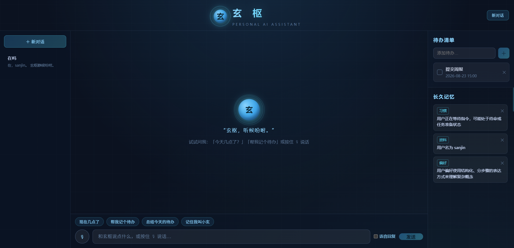
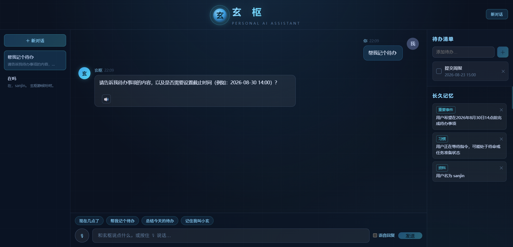
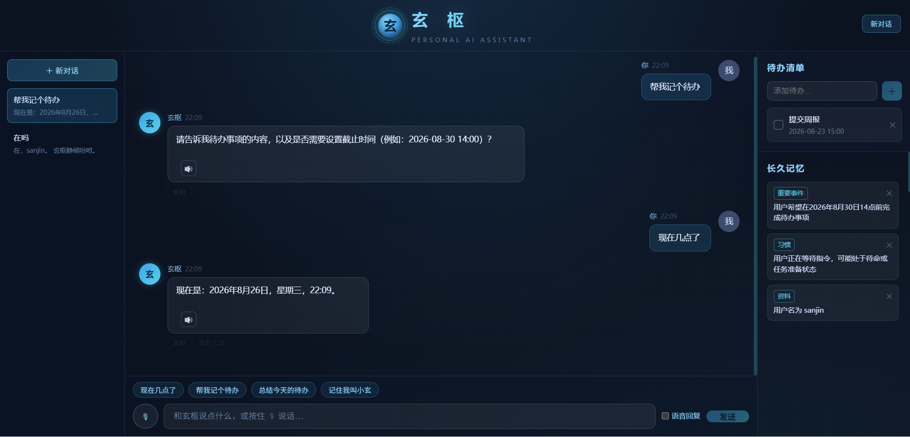

# 玄枢 · 个人智能生活助手 Agent

> “玄枢，听候吩咐。”

一个基于 **Python + FastAPI + LangChain + LangGraph + Vue 3 + 阿里云百炼** 的个人 AI 助手，
具备对话、工具调用、短期/长期记忆、SSE 流式输出与语音交互能力。

灵感来自《钢铁侠》的 JARVIS，但保持简单、稳定、可理解 —— 这是一个学习型项目，
目标是真正掌握 AI Agent 开发全流程，并成为可写进简历的纯 Python 项目。

## 运行界面







## 功能路线（当前进度：Phase R ✅）

| Phase | 功能 | 状态 |
|-------|------|------|
| 1 | FastAPI + Vue + 百炼 LLM + 基础聊天 | ✅ 完成 |
| 2 | LangGraph（START→agent→END） | ✅ 完成 |
| 3 | SSE 流式输出 | ✅ 完成 |
| 4 | 工具调用（时间/Todo/Note/计算器）+ SQLite | ✅ 完成 |
| 5 | 短期记忆（多轮对话） | ✅ 完成 |
| 6 | 长期记忆（自动提取 + 召回） | ✅ 完成 |
| 7 | 语音识别（百炼 ASR） | ✅ 完成 |
| 8 | 语音合成（百炼 TTS） | ✅ 完成 |
| 9 | 前端打磨（科幻+古风科技感） | ✅ 完成 |
| 10 | Docker 部署 | ✅ 完成 |
| R | 向量检索 RAG（语义+词法混合召回） | ✅ 完成 |

## 快速开始

### 0. 准备 API Key

阿里云百炼控制台获取 API Key，配置为环境变量（推荐）：

```bash
# Windows
setx AI_CHAT_API_KEY "sk-xxxx"
```

或复制 `backend/.env.example` 为 `backend/.env` 并填写 `DASHSCOPE_API_KEY`。

### 1. 启动后端

```bash
cd backend
python -m venv .venv
.venv/Scripts/activate          # Windows；macOS/Linux: source .venv/bin/activate
pip install -r requirements.txt
python -m uvicorn app.main:app --reload --port 8000
```

- Swagger 调试：http://localhost:8000/docs
- 健康检查：http://localhost:8000/health

### 2. 启动前端

```bash
cd frontend
npm install
npm run dev                     # http://localhost:5173
```

开发期 Vite 将 `/api` 代理到后端 8000 端口。

> **端口冲突怎么办？**（8000 已被 Docker/其他服务占用等）
> ```bash
> # 后端换端口（例：8001）
> cd backend && .venv/Scripts/python -m uvicorn app.main:app --port 8001
>
> # 前端换端口（例：5174），并让代理指向新后端地址
> cd frontend && VITE_API_TARGET=http://127.0.0.1:8001 npm run dev -- --port 5174
> ```
> `VITE_API_TARGET` 是 Vite 代理目标的环境变量（默认 `http://127.0.0.1:8000`，无需改代码）。

## Docker 部署（生产模式）

一键起全栈（前端 nginx 托管 + 反代，后端 uvicorn，SQLite 持久卷）：

```bash
# 1. 准备 API Key（任意一种）
export DASHSCOPE_API_KEY="sk-xxxx"        # 或写入根目录 .env
# Windows PowerShell: $env:DASHSCOPE_API_KEY="sk-xxxx"

# 2. 构建并启动
docker compose up -d --build

# 3. 访问
#   前端入口   http://localhost:8080
#   后端直连   http://localhost:8000/docs（Swagger）
#   数据卷     xuan_shu_data（SQLite 持久化，重建容器不丢）
```

- 停止：`docker compose down`（保留数据卷）；彻底清理：`docker compose down -v`
- 架构：`frontend(nginx:80) --反代 /api--> backend(uvicorn:8000) --SQLite--> 卷`
- SSE 已在 nginx 关闭缓冲（`proxy_buffering off`），逐字输出正常

## 技术栈

- **后端**：Python 3.13 / FastAPI / Uvicorn / Pydantic / SQLAlchemy / SQLite
- **Agent**：LangChain / LangGraph / Tool Calling / Structured Output
- **模型**：阿里云百炼 Qwen 系列（OpenAI 兼容接口）
- **前端**：Vue 3 / Vite / TypeScript / Axios / Web Audio API
- **通信**：HTTP + SSE

## 项目结构

```text
backend/
├── app/
│   ├── main.py           # FastAPI 入口
│   ├── config.py         # 配置中心（环境变量）
│   ├── api/              # 路由层
│   ├── services/         # LLM/ASR/TTS 服务层
│   ├── schemas/          # Pydantic 数据模型
├── tests/                # pytest 测试
frontend/
├── src/
│   ├── views/            # 页面
│   ├── components/       # 组件
│   ├── composables/      # 组合式函数
│   └── services/         # API 封装
docs/                     # 架构/Agent/记忆/API 文档
```

## 文档

- [架构文档](docs/architecture.md)
- [Agent 设计](docs/agent.md)
- [API 文档](docs/api.md)
- [记忆系统](docs/memory.md)

## 学习目标

1. Python AI Agent 开发全流程
2. FastAPI / LangChain / LangGraph
3. Agent / Tool Calling / Memory 原理
4. HTTP + SSE 前后端通信
5. 语音输入输出接入

## 路线图（V2+，暂不实现）

V2：天气 / 网页搜索 / 日历 / 番茄钟
V3：RAG 知识库 / 文件读取 / PDF 总结
V4：MCP / 多 Agent / 电脑控制
